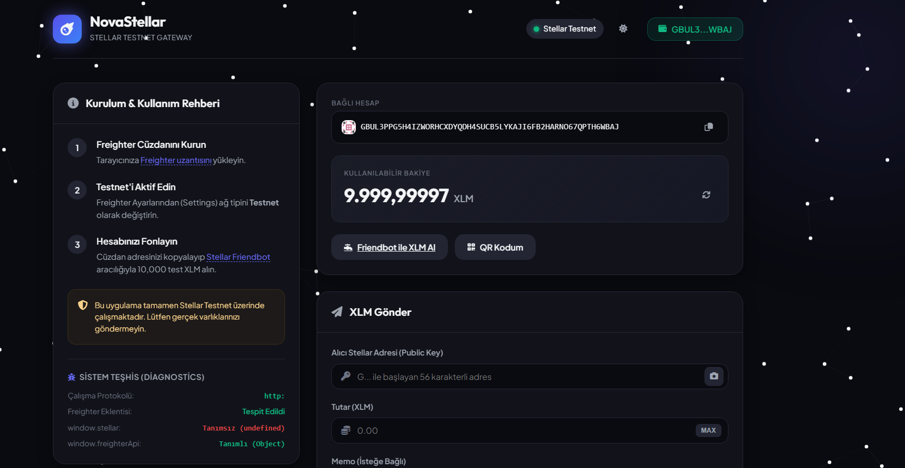
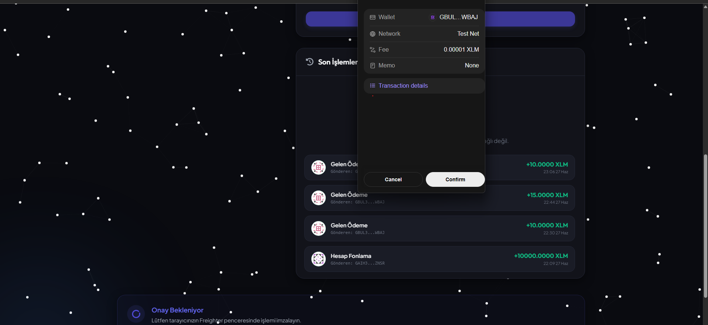
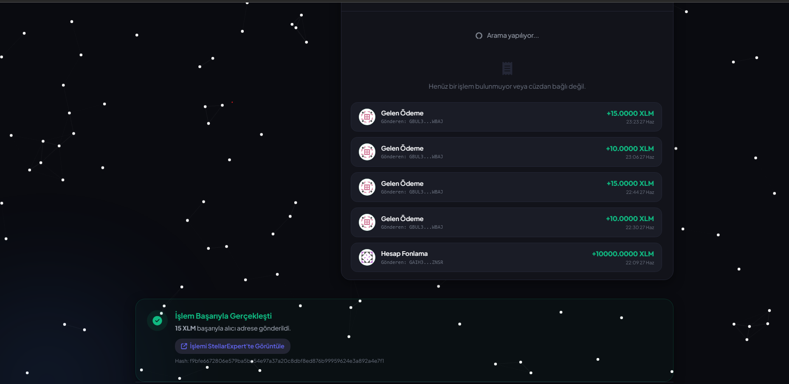

# NovaStellar Wallet Dashboard

## Project Description
NovaStellar is a modern, web-based dashboard designed to interact with the Stellar Testnet. It provides users with a seamless Web3 experience by integrating with the Freighter browser wallet. Users can easily view their balances, receive payments via QR codes, track their transaction history, and send XLM to other addresses with interactive visual feedback. The application features a fully responsive UI, an eye-catching starry background, a dark/light mode toggle, and algorithmic profile avatars (Identicons) for all Stellar addresses.

## Features
- **Wallet Connection:** Connect seamlessly using the Freighter extension.
- **Balance & History:** Real-time balance updates and a detailed list of recent incoming/outgoing payments.
- **Transaction Flow:** Send XLM securely with integrated Freighter signing.
- **QR Code Suite:** Generate QR codes to receive funds and scan QR codes using a webcam or image upload to quickly input recipient addresses.
- **Visual Enhancements:** Interactive particle background, Dark/Light theme switching, algorithmic address avatars (jdenticon), and confetti celebration on successful transactions.

## Setup Instructions (How to run locally)

1. **Clone the repository:**
   ```bash
   git clone <YOUR_GITHUB_REPO_URL>
   cd stellar-wallet-app
   ```

2. **Run a local web server:**
   Because this application uses native browser APIs and interacts with browser wallet extensions, it must be run via a local web server (not by double-clicking the `index.html` file).
   
   If you have Node.js installed:
   ```bash
   npx http-server -p 8080
   ```
   *Alternatively, using Python:*
   ```bash
   python -m http.server 8080
   ```
   *Alternatively, using .NET:*
   ```bash
   dotnet serve -p 8080
   ```

3. **Open the application:**
   Navigate to `http://localhost:8080` in your web browser.

4. **Wallet Setup:**
   - Install the [Freighter Wallet Extension](https://www.freighter.app/).
   - Open Freighter Settings and switch the network to **Testnet**.
   - Fund your Testnet account using the [Stellar Laboratory Friendbot](https://laboratory.stellar.org/#account-creator?network=test).

## Screenshots

### 1. Wallet Connected State

*Shows the main dashboard after successfully connecting the Freighter wallet, displaying the user's address with an identicon.*

### 2. Balance Displayed

*Shows the available XLM balance dynamically fetched from the Stellar Testnet Horizon network.*

### 3. Successful Testnet Transaction

*Shows the transaction form with details filled out, or the Freighter popup prompting to sign.*

### 4. Transaction Result Shown to User

*Shows the feedback card indicating a successful transaction along with the transaction hash link and confetti animation.*
